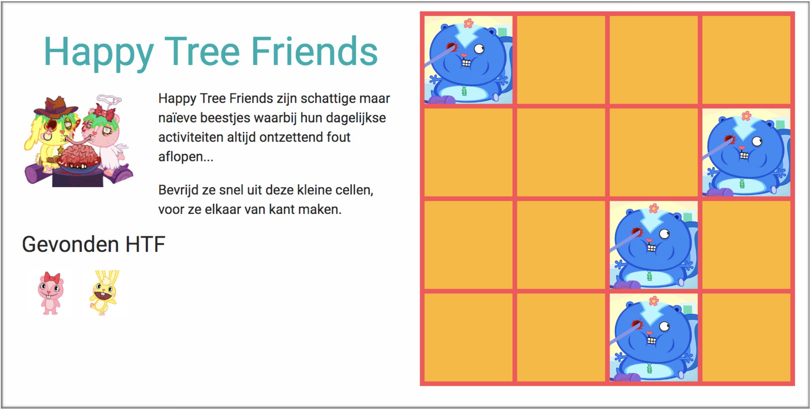

# Happy Tree Friends

4 categories

- Only the exercise ***master***
- Exercise + steps in comments ***guided***
- Exercise + steps in comments + start-code ***extra-guided***
- Solution ***solution***


Excercise - normal
-------

Download de broncode voor deze oefening. [BronCode](./assets/startcode_happy_tree_friends.zip){: download }



Het doel van deze oefening zal iedereen wel kennen. Er zijn een even aantal kaartjes in het spel waar er telkens 2 dezelfde inzitten. De kaartjes zitten willekeurig verdeeld met de zichtbare kant aar onder.
Je mag maximum 2 kaartjes tegelijk omdraaien/bekijken. Zijn die niet identiek, dan draai je ze terug naar onder.


Zijn ze wel identiek, dan neem je ze weg van het spel. Indien alle kaartjes uit het spel zijn, is het afgelopen.
Deze oefening gebruikt volgende zaken die je reeds geleerd hebt uit de theorie- en praktijklessen + de inhoud van het handboek.

 

- Variabelen (strings, arrays, … en de scope van de variabele)
- Functies (met en zonder parameters, onclick functie)
- Voorwaardes & Lussen
- Manipulatie van de DOM De broncode die je terugvindt op codepen bevat startcode. Hiermee wordt reeds per nieuwe sessie de tabel willekeurig gevuld met afbeeldingen van Happy Tree Friends (verder afgekort als HTF).

Analyseer de code tot je deze begrijpt alvorens je verder gaat.
Je zal opmerken dat alle kaartjes/vakjes reeds zichtbaar zijn. Dat is natuurlijk niet de bedoeling.
Via css zet je de opacity van de vakjes op 0.

 
### Streefdoel 1: vakje zichtbaar maken na een klik

- Na een click op een vakje (block) maak je dat vakje zichtbaar
- Dit moet voor elk vakje, dus ik heb het onclick event BINNEN de lus gedefinieerd. Gevolg, de lus “loopt” door elke block waardoor je slechts eenmaal de onclick functie moet aanmaken.
- **Tip**: zichtbaar maken doe je door de .style.opacity = … van de var block te manipuleren
- Voeg de geklikte block in de array activeBlocks via activeBlocks.push(…)
- Als dit werkt, steek de functionaliteit dan in de nieuwe functie: `function showBlock(block) {…}`

 
### Streefdoel 2: maximum 2 vakjes tegelijk zichtbaar

- Er mogen maximum 2 vakjes tegelijk zichtbaar zijn
- Steek een voorwaarde in de onclick functie waarbij je controleert hoeveel activeBlocks er zijn.
- Indien het maximum bereikt is, mogen er geen extra blocks zichtbaar gemaakt worden

 
### Streefdoel 3: Vakjes terug omdraaien na een bepaalde tijd

- Indien er twee vakjes zichtbaar staan, ze na 2 seconden terug onzichtbaar maken
- Hiervoor maak je gebruik van `setTimeout(…);`
- https://www.w3schools.com/jsref/met_win_settimeout.asp
- **TIP**: Via een lus kan je alle zichtbare blocks terug onzichtbaar maken (opacity terug 0)

 
### Streefdoel 4: Omdraaien indien niet gelijk, verwijderen indien wel gelijk

- Als de vakjes wel gelijk zijn, moeten ze natuurlijk niet omgedraaid worden
- Maak een functie die controleert of ze gelijk zijn
    - zo ja: verander de class van de gevonden, gelijke blocks naar `"memory-found"` .
    - zo nee: maak de zichtbare blocks terug onzichtbaar (opacity dus terug op 0)

 
### Streefdoel 5: De “gevonden” happy tree friends toevoegen aan de linkerkolom

- In de linkerkolom staat een lege container (een div met ```id="found"```).
- Als er 2 identieke vakjes gevonden zijn, voeg dan een div toe aan de container. Die div bevat:
    - `className = “small-found”`
    - `backgroundImage = … (de achtergrond van de identieke “gevonden” vakjes)`

